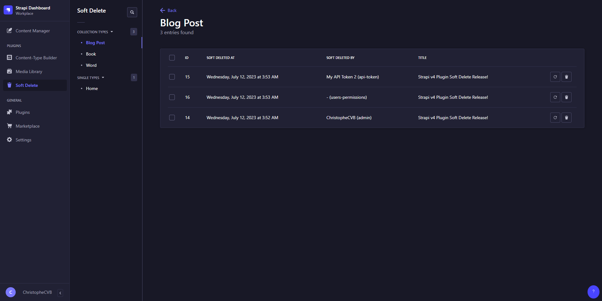

<div align="center" width="150px">
  
</div>
<div align="center">
  <h1>Strapi v4 - Soft Delete plugin</h1>
  <p>Powerful Strapi based Soft Delete feature, never loose content again</p>
  <a href="https://www.npmjs.org/package/strapi-plugin-soft-delete">
    
  </a>
  <a href="https://www.npmjs.org/package/strapi-plugin-soft-delete">
    
  </a>
</div>

---

<div style="margin: 20px 0" align="center">
  
</div>

A plugin for [Strapi Headless CMS](https://github.com/strapi/strapi) that provides a Soft Delete feature.

## ✨ Features

- 🛢 Database
  - Adds `_softDeletedAt`, `_softDeletedById` and `_softDeletedByType` fields to all your collection and single content types. Those fields are not visible in the Content Manager nor through the API.
- 🗂️ Content Manager & API
  - The delete from the Content Manager & API behaves as a soft delete. It will set `_softDeletedAt` to the current datetime, `_softDeletedById` to the action initiator id that deleted it and `_softDeletedByType` to the type of the delete action initiator.
- 👤 RBAC
  - The `Delete` is renamed to `Soft Delete` and it is located in the `Settings > Roles > Edit a Role > Collection Types | Single Types` section.
  - A new admin permission is added to the `Settings > Roles > Edit a Role > Collection Types | Single Types` section. This is the `Deleted Read` permission. This will allow the admin role to view the soft deleted entries.
  - A new admin permission is added to the `Settings > Roles > Edit a Role > Collection Types | Single Types` section. This is the `Deleted Restore` permission. This will allow the admin role to restore the soft deleted entries.
  - A new admin permission is added to the `Settings > Roles > Edit a Role > Collection Types | Single Types` section. This is the `Delete Permanently` permission. This will allow the admin role to delete permanently the soft deleted entries.
  - A new admin permission is added to the `Settings > Roles > Edit a Role > Plugins > Soft Delete` section. This is the global `Read` permission of the plugin. This will allow the admin role to view the Soft Delete item in the Admin left Panel. Accessing this will list all the content types the admin role has access to. They can restore or delete permanently the entries from here depending on the above permissions.
  - A new admin permission is added to the `Settings > Roles > Edit a Role > Plugins > Soft Delete` section. This is the global `Settings` permission of the plugin. This will allow the admin role to view the Soft Delete plugin settings.
- 🗂️ Soft Delete Explorer (Admin left Panel item): Displays Soft Deleted Collection & Single Type entries 
  - ♻️ Entries can be restored with the `Restore` action. This will set the fields `_softDeletedAt`, `_softDeletedById` and `_softDeletedByType` to `null`.
  - 🗑️ Entries can be permanently deleted with the `Delete Permanently` action. This will delete the entry permanently from the databse.
- ⚙️ Settings
  - Restoration Behavior: This setting allows you to choose the behavior when restoring an entry.
    - Single Type
      - Soft Delete: Restoring a Single Type entry will restore it to the Content Manager explorer and Soft Delete the existing entry.
      - Delete Permanently: Restoring a Single Type entry will restore it to the Content Manager explorer and Delete Permanently the existing entry.
    - Draft & Publish
      - Draft: Restoring a Draft & Publish entry will restore it to the Content Manager explorer as a draft.
      - Unchanged: Restoring a Draft & Publish entry will restore it to the Content Manager explorer unchanged, meaning that if the entry was published, it will be restored as published.

## ⛔ Permissions

| Section | Permission | Description |
| ---------- | ---------- | ----------- |
| Collection & Single Types | `Deleted Restore` | Allows the admin role to restore the soft deleted entries. |
| Collection & Single Types | `Deleted Read` | Allows the admin role to view the soft deleted entries. |
| Collection & Single Types | `Delete Permanently` | Allows the admin role to delete permanently the soft deleted entries. |
| Plugins | `Read` | Allows the admin role to view the Soft Delete item in the Admin left Panel. |
| Plugins | `Settings` | Allows the admin role to view the Soft Delete plugin settings. |

## 📦 Compatibility

| Strapi Version | Plugin Version |
| -------------- | -------------- |
| ^4.11          | 1.0.0          | <!-- FIXME: From which Strapi v4 does the plugin work -->
| ^3             | Not Supported  |

> This plugin is designed for **Strapi v4** and will not work with v3.x.

## 🚨 Caveats

Because of the way the plugin handles soft deleted entries, there are some caveats to be aware of:
- Lifecycle hooks:
  - `beforeDelete`, `afterDelete`, `beforeDeleteMany` and `afterDeleteMany` lifecycle hooks are not triggered when soft deleting entries. Instead, the `beforeUpdate`, `afterUpdate`, `beforeUpdateMany` and `afterUpdateMany` are. <!-- Instead, the new `beforeSoftDelete`, `afterSoftDelete`, `beforeSoftDeleteMany` and `afterSoftDeleteMany` lifecycle hooks are triggered. --><!-- TODO: Is it possible to create custom lifecyle hooks? Maybe by wrapping https://github.com/strapi/strapi/blob/40b3acfe6f9bb9ff73dfba951090731879b87ec5/packages/core/strapi/lib/services/event-hub.js#L22 -->
  - `beforeDelete`, `afterDelete`, `beforeDeleteMany` and `afterDeleteMany` lifecycle hooks are triggered when deleting permanently an entries.

## ⏳ Installation

To install this plugin, you need to add an NPM dependency to your Strapi application:

```sh
# Using Yarn
yarn add strapi-plugin-soft-delete

# Or using PNPM
pnpm add strapi-plugin-soft-delete

# Or using NPM
npm install strapi-plugin-soft-delete
```

Edit your `config/plugins.js|ts` or `config/<env>/plugins.js|ts` file and add the following configuration:

```js
// ...
  "soft-delete": {
    enabled: true,
  },
// ...
```

Then, you'll need to build your admin panel:

```sh
# Using Yarn
yarn build

# Or using PNPM
pnpm run build

# Or using NPM
npm run build
```

Finally, start your application:

```sh
# Using Yarn
yarn develop

# Or using PNPM
pnpm run develop

# Or using NPM
npm run develop
```

## 🤝 Contributing

Feel free to fork and make a PR if you want to add something or fix a bug.

## 🛣️ Roadmap

- 🖧 Server
  - [x] `_softDeletedAt` field on API Content Types
  - [x] `_softDeletedById` field on API Content Types
  - [x] `_softDeletedByType` field on API Content Types
  - [x] Decorate Content Type Entity Services to handle `_softDeleted*` fields when deleting an entry upon `delete` or `deleteMany` methods
  - [x] Decorate Content Type Entity Services to hide entries upon `find` or `findMany` methods
  - [x] RBAC Permissions
  - [x] Admin Routes
  - [x] Single Type entry restore special case
  - [x] Draft & Publish support when restoring an entry
  - [ ] Custom Lifecycle Hooks
  - [ ] Handle Soft Deleting Components
  - [ ] Add tests
- 🗂️ Soft Delete Explorer
  - [x] Content Types list
  - [x] Entries list
    - [ ] Pagination
    - [ ] Filters
  - [x] Restore action
  - [x] Delete Permanently action
  - [x] Translation
  - [ ] Soft Deleted Entry details
- ⚙️ Plugin Settings
  - [x] Restoration Behavior
    - [x] Single Type
    - [x] Draft & Publish
  - [ ] Deletion Automation

## 🚮 Uninstall

To uninstall this plugin, you need to remove the NPM dependency from your Strapi application:

```sh
# Using Yarn
yarn remove strapi-plugin-soft-delete

# Or using PNPM
pnpm remove strapi-plugin-soft-delete

# Or using NPM
npm uninstall strapi-plugin-soft-delete
```

Edit your `config/plugins.js|ts` or `config/<env>/plugins.js|ts` file and remove the following configuration:

```js
// ...
  "soft-delete": {
    enabled: true,
  },
// ...
```

Also, _**if you have edited your API Content Types through the Content Builder**_, and because the plugin adds fields to it, you'll need to remove them from the schemas manually. The fields are:
- `_softDeletedAt`
- `_softDeletedById`
- `_softDeletedByType`

Then, you'll need to build your admin panel:

```sh
# Using Yarn
yarn build

# Or using PNPM
pnpm run build

# Or using NPM
npm run build
```

Finally, start your application:

```sh
# Using Yarn
yarn develop

# Or using PNPM
pnpm run develop

# Or using NPM
npm run develop
```

## 👨‍💻 Community support

For general help using Strapi, please refer to [the official Strapi documentation](https://docs.strapi.io/). For additional help, you can use one of these channels to ask a question:

- [Discord](https://discord.strapi.io/) I'm present on official Strapi Discord workspace. Find me by `ChristopheCVB`.
- [GitHub](https://github.com/ChristopheCVB/strapi-plugin-soft-delete/issues) (Bug reports, Contributions, Questions and Discussions)

## 📝 License

[MIT License](LICENSE.md) Copyright (c) [ChristopheCVB](https://www.christophecvb.com/).
